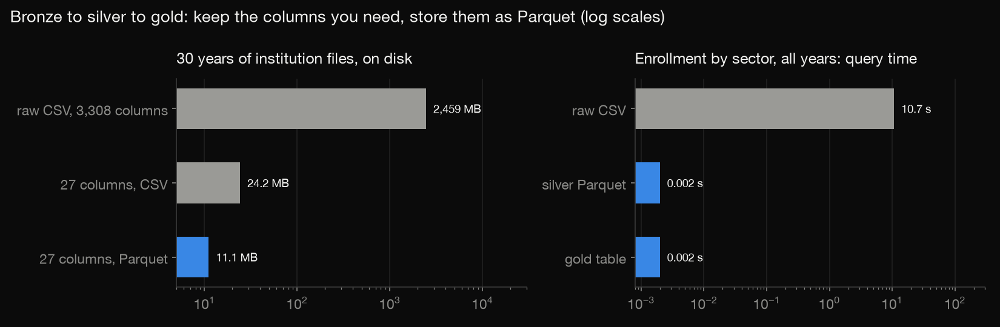
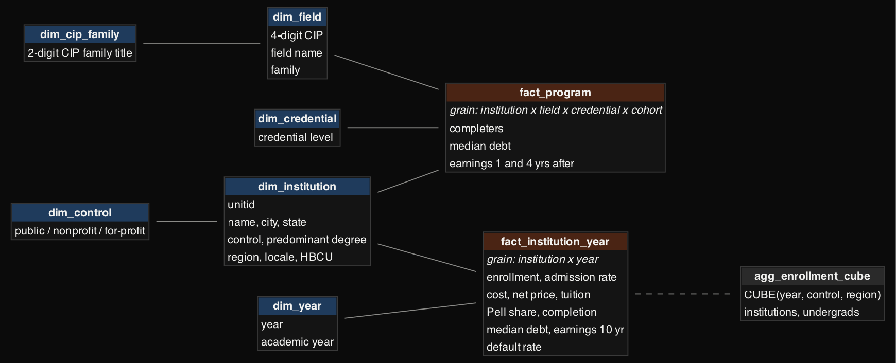
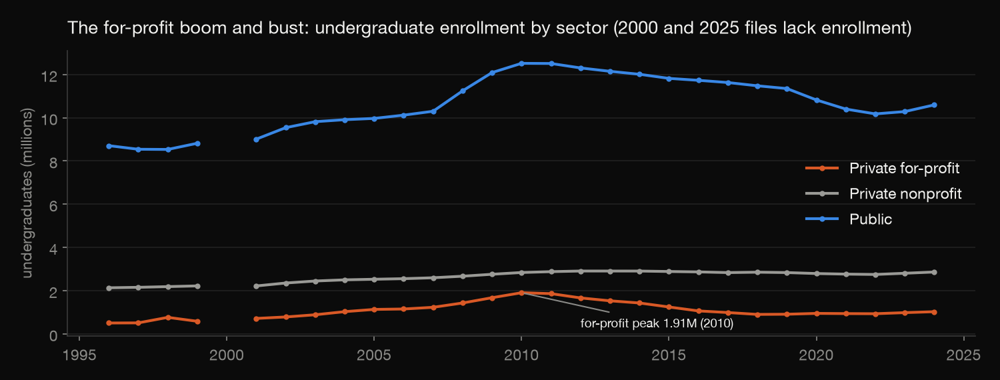

# College Scorecard warehouse: 30 years of US colleges, from a 3.6 GB download to a star schema

The US Department of Education's College Scorecard is free, but it comes as 30 annual CSV files of 3,308 columns each,
plus field-of-study files, 3.6 GB in all. Answering "what did for-profit colleges cost, and what did students earn?"
straight from those files means scanning gigabytes every time. This project builds a small data warehouse in layers:
- **bronze**: the raw download, untouched;
- **silver**: a Parquet lake with only the columns needed, typed, and null tokens cleaned;
- **gold**: a DuckDB star schema with two fact grains, conformed dimensions and a pre-aggregated CUBE.

Then it answers real questions from the gold layer.

Build log: https://mrrishit909.github.io/projects/college-scorecard-warehouse/

## Data

College Scorecard full data download (US Department of Education, released June 2026):
- 30 institution files, academic years 1996-97 to 2025-26;
- 8 field-of-study cohort files (1415_1516 to 2122_2223);
- the NCES CIP 2020 code list, used for field-family names.

`lake.py` downloads them. Not committed (2.5 GB of institution CSVs, 1.1 GB of program CSVs).

## Steps

| Step | File | What it does |
|---|---|---|
| 1-2 | `lake.py` | download; bronze CSV → silver Parquet (27 institution columns, partitioned by year; program files by cohort); counts privacy-suppressed and null values before cleaning them |
| 3 | `sql/01_gold.sql`, `sql/02_marts.sql`, `build.py` | gold star schema, marts, and a raw-CSV vs Parquet vs gold benchmark |
| 4 | `check.py` | recomputes each layer from the one below |
| 5 | `charts.py` | the charts below |
| 6 | (fix) | sector as reported each year goes on the fact (see "As-was vs as-is") |

Run: `python3 -m venv venv && ./venv/bin/pip install pandas duckdb matplotlib pyarrow`, then
`./venv/bin/python lake.py && ./venv/bin/python build.py && ./venv/bin/python check.py && ./venv/bin/python charts.py`.
Graphviz `dot` is needed for the schema diagram.

## The layers

| | Size | Query: enrollment by sector, all 30 years |
|---|---|---|
| bronze: raw CSV, 3,308 columns | 2,459 MB | 12.83 s |
| the same 27 columns as CSV | 24.2 MB | |
| silver: 27 columns as Parquet | 11.1 MB | 0.003 s |
| gold: `fact_institution_year` | (in DuckDB) | 0.001 s |

Keeping only the needed columns does most of the work (2,459 MB → 24.2 MB). Parquet halves what is left and is
columnar, so a query reads only the columns it uses. The program files shrink from 1,145 MB to 12.9 MB. The three
queries return the same totals; `build.py` checks that (`results/benchmark.json`). Timings vary by a few seconds
between runs.

**Null tokens.** The files write missing values four ways: `NULL`, `PrivacySuppressed`, `PS` and `NA`. Silver turns
all four into real NULLs, but first counts them (`results/suppression_by_year.csv`, totals in `results/suppression.csv`).
For example, median debt is privacy-suppressed in 41,515 institution-years.

## The model

- `fact_institution_year`: one row per institution per year, 208,759 rows.
- `fact_program`: one row per institution × field × credential × cohort, 1,780,603 rows.
- Dimensions:
  - `dim_institution` holds 12,533 institutions, each with its latest attributes;
  - `dim_year`;
  - `dim_control`;
  - `dim_field` holds 449 four-digit CIP fields;
  - `dim_cip_family`;
  - `dim_credential`.
- Row and file counts: `results/warehouse_counts.json`.
- `agg_enrollment_cube`: `GROUP BY CUBE (year, control, region)` with `grouping_id`, so a dashboard can read any
  subtotal without re-aggregating.

**Measures arrive sparsely** (`results/measure_availability.csv`, chart 3):
- 10-year earnings exist only in the 2007, 2009, 2011–2014 and 2020 files.
- Median debt stops after 2020.
- The 2000 file has no enrollment.
- The 2025-26 file carries none of these measures yet.

Each question below therefore uses a year where its measures meet.

### As-was vs as-is

The first version took each institution's sector (public / nonprofit / for-profit) from its latest file, Type 1 style.
But 369 institutions changed sector between files (`results/sector_switches.csv`):
- 206 switches from for-profit to nonprofit;
- 121 from nonprofit to for-profit;
- 26 from for-profit to public.

Examples are Grand Canyon University and Purdue University Global. Filing their whole history under today's sector
rewrote the past: the 2010 for-profit peak dropped from 2,186,060 to 1,905,205 undergraduates
(`results/sector_attribution.csv`).

The fix: the fact now stores the sector and degree mix as reported that year, and the cube and marts use them. The
dimension keeps the latest values for "as-is" questions. 19 of the 418 switches undo the previous one, which is more
likely a coding fix than a real conversion. 29 institution-years have no sector at all (2002, 2006–2008, with no
enrollment). They stay NULL and drop out of the sector views.

## Results

**For-profit boom and bust** (undergraduates, as reported):
- 510,852 in 1996;
- a peak of 2,186,060 in 2010;
- 1,068,635 in 2020;
- 1,124,457 in 2024.

**Cost and payoff, predominantly bachelor's institutions, 2020-21 file** (medians across institutions):

| | Public | Nonprofit | For-profit |
|---|---|---|---|
| institutions | 581 | 1,265 | 171 |
| net price per year | $14,327 | $22,310 | $23,312 |
| median debt at graduation | $20,632 | $25,000 | $26,312 |
| earnings 10 yrs after entry | $53,966 | $53,794 | $40,092 |
| debt ÷ earnings | 0.38 | 0.45 | 0.61 |
| completion rate | 52% | 58% | 33% |

**Fields of study** (bachelor's programs, 2018-20 completers, the one cohort file with both earnings and debt):
- Engineering graduates earn a median $83,620 four years out, with $23,107 of debt (0.28 of a year's pay).
- Visual and performing arts graduates earn $35,442, with $24,702 of debt (0.67).

Debt is similar across fields; pay is not (`results/bachelors_by_field.csv`, chart 6).

**Who is still here.** Of institutions in any file up to 2010, these are not in the 2025-26 file:
- 72.7% of for-profits (3,682 of 5,068);
- 39.2% of nonprofits;
- 24.2% of publics.

"Not in the file" includes closures, but also mergers and branch campuses folded into a parent's reporting.

**Tuition** (median in-state, predominantly bachelor's):
- public: $3,132 in 2000 → $9,958 in 2024;
- nonprofit: $13,495 → $34,762.

Amounts are in nominal dollars (`results/tuition_trend.csv`).

## The check

`check.py` fails loudly if a layer stops agreeing with the one below it:
- For four years (2000, 2010, 2012, 2020), it recomputes from the raw CSVs: row counts, enrollment, for-profit
  enrollment against the cube cell, and suppressed-value counts.
- No suppression token survives in silver.
- There is one fact per institution-year, every fact has an institution, and every sector code is valid.
- The dimension holds each institution's latest attributes.
- The CUBE's subtotals and grand total add up.
- The 2020 sector medians and engineering's medians recompute in pandas from Parquet.
- Raw CSV, Parquet and gold return the same totals.

## Not done

- No scheduled refresh. Rerunning the scripts rebuilds everything from scratch, which is fine at this size; a growing
  source would need incremental loads.
- Medians are across institutions (or programs), not weighted by students.
- Dollar amounts are not adjusted for inflation.
- The field-of-study files' many other measures (by gender, Pell status, and so on) are not loaded.
